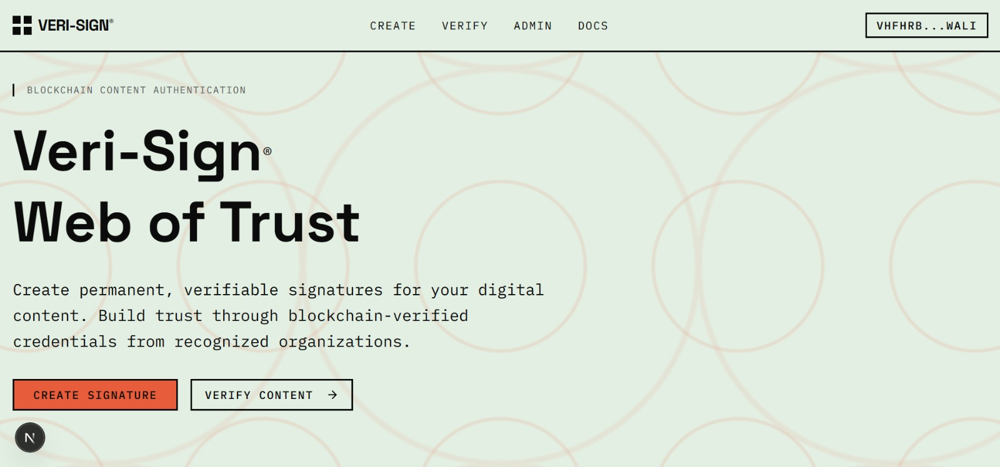
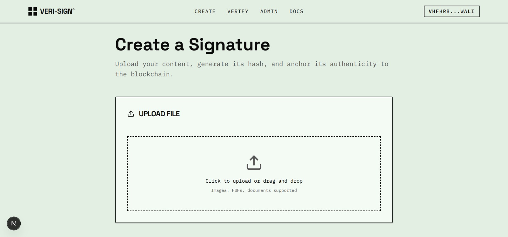
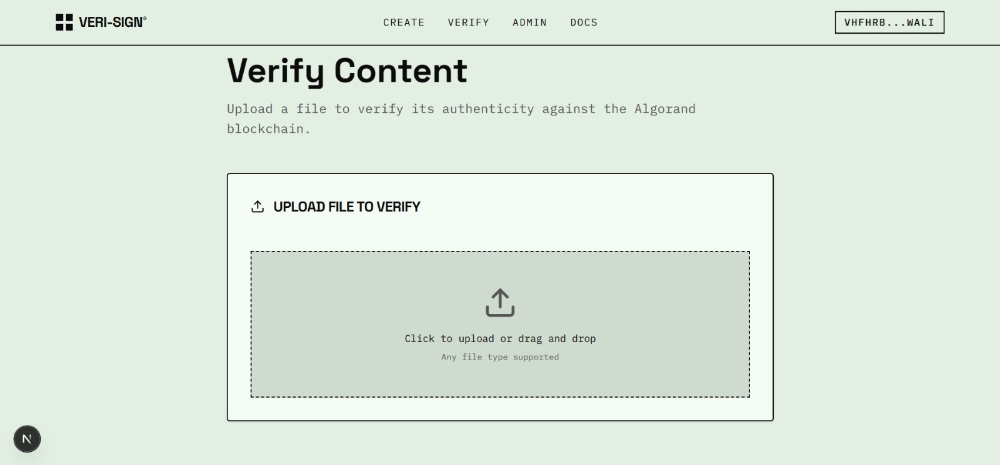
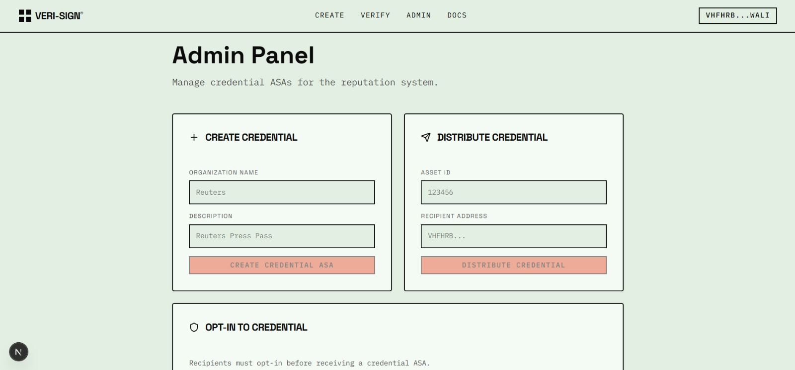
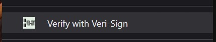
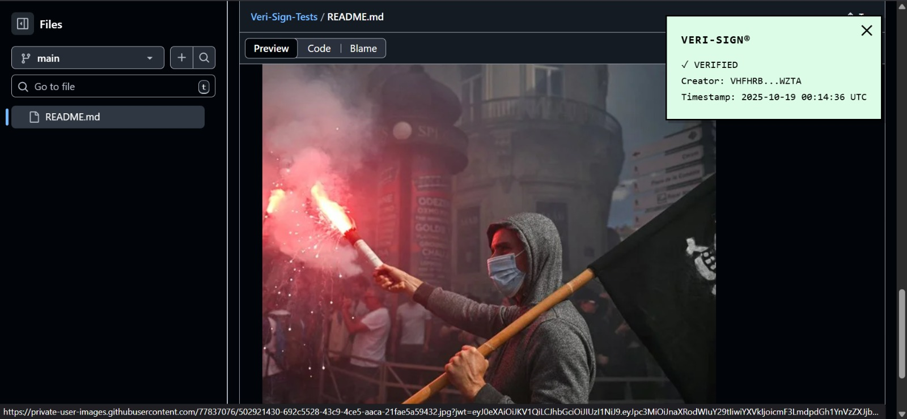

# Veri-Sign: Blockchain Content Authentication Platform

<div align="center">


**Create a Web of Trust for Digital Content**

[](https://testnet.algoexplorer.io/application/747976847)
[](https://nextjs.org/)
[](https://www.typescriptlang.org/)

[Demo Video](#demo-video) • [Live Demo](#) • [Documentation](#documentation)

</div>

---

## 📹 Demo Video

> **[(https://www.youtube.com/watch?v=BktvF5m3Oj0)]**
> 
> A comprehensive walkthrough showing:
> - How to create blockchain signatures for content
> - Credential ASA creation and distribution
> - Enhanced verification with organizational credentials
> - Chrome extension demonstration
> - Smart contract architecture explanation

---

## 🎯 What is Veri-Sign?

Veri-Sign creates a **"Web of Trust"** for digital content by combining blockchain authentication with organizational reputation. In an era of AI-generated content and misinformation, we need more than just "is this real?" - we need **"is this from a trusted source?"**

### The Problem
- AI-generated fakes are indistinguishable from real content
- No way to verify if content comes from trusted organizations
- Anonymous blockchain signatures don't establish credibility
- Readers can't distinguish between random wallets and verified journalists

### The Solution: Two-Layer Verification

**Layer 1: Core Attestation**
- Anyone can create immutable, timestamped signatures for content
- File hash stored on Algorand blockchain linked to wallet address
- Proves authenticity and ownership

**Layer 2: Organizational Reputation**
- Verified organizations mint non-transferable credential ASAs
- Credentials distributed to verified members (journalists, researchers)
- Verification shows "✓ Verified by Reuters" instead of wallet addresses
- Creates true organizational accountability

---

## 🖼️ Screenshots

### Web Application

#### Homepage

*Clean, brutalist design with clear call-to-action*

#### Create Signature

*Upload content, generate hash, create blockchain signature*

#### Verify Content

*Instant verification with organizational credentials*

#### Admin Panel

*Manage credential ASAs and distribute to members*

### Chrome Extension

#### Right-Click Verification


*Verify any image with a right-click*

#### Verification Result

*On-page overlay showing verification status*

---

## 🏗️ Architecture

### Smart Contract (Algorand)

**Deployed Contract:** [747976847 on TestNet](https://testnet.algoexplorer.io/application/747976847)

```python
class VerisignApp(ARC4Contract):
    """
    Core attestation contract for content signatures
    """
    def __init__(self) -> None:
        # BoxMap stores attestations: file_hash -> (creator_address, timestamp)
        self.attestations = BoxMap(Bytes, Attestation, key_prefix=b"a")
    
    @abimethod()
    def attest(self, file_hash: Bytes) -> Attestation:
        """
        Create immutable signature for content
        - Ensures first-to-sign-wins policy
        - Stores creator address and timestamp
        - Returns attestation struct
        """
        assert file_hash not in self.attestations, "Content already attested"
        
        new_attestation = Attestation(
            creator_address=Address(Txn.sender),
            timestamp=UInt64(Global.latest_timestamp)
        )
        
        self.attestations[file_hash] = new_attestation.copy()
        return new_attestation
```

**Key Features:**
- **Box Storage:** Dynamic key-value storage for attestations without predefined schema
- **ARC4 Compliance:** Standardized ABI method calls for interoperability
- **First-to-Sign-Wins:** Prevents duplicate attestations for same content
- **Immutable Records:** Permanent proof of creation and ownership

### How the Smart Contract Works

1. **Attestation Creation:**
   - User uploads file → SHA-256 hash generated client-side
   - Hash sent to `attest()` method with ABI encoding
   - Contract checks if hash already exists (prevents duplicates)
   - Stores `Attestation(creator_address, timestamp)` in box storage
   - Returns attestation to user

2. **Box Storage Structure:**
   ```
   Key: b"a" + file_hash (33 bytes total)
   Value: creator_address (32 bytes) + timestamp (8 bytes)
   ```

3. **Verification Query:**
   - Query box storage with file hash
   - Decode attestation struct
   - Check Algorand Indexer for credential ASAs
   - Return verification result with organization info

4. **Credential System (Layer 2):**
   - Organizations create ASAs with `freeze` and `clawback` enabled
   - Non-transferable design prevents credential trading
   - Members opt-in to receive credentials
   - Verification checks if creator holds registered credential ASA

---

## 🔧 Technology Stack

### Blockchain
- **Algorand TestNet** - Fast finality, low costs, carbon-negative
- **Smart Contracts** - Python/Beaker with AlgoKit
- **ASAs** - Non-transferable credential tokens
- **Box Storage** - Dynamic attestation storage
- **Indexer API** - Fast credential queries

### Frontend
- **Next.js 15** - React framework with App Router
- **TypeScript** - Type-safe development
- **Tailwind CSS** - Utility-first styling
- **Pera Wallet** - Seamless wallet integration
- **algosdk** - Algorand JavaScript SDK

### Browser Extension
- **Chrome Manifest V3** - Modern extension architecture
- **Vanilla JavaScript** - Lightweight implementation
- **Background Service Worker** - Blockchain queries
- **Content Scripts** - On-page result display

---

## 🚀 Getting Started

### Prerequisites
- Node.js 18+
- Pera Wallet (mobile or browser extension)
- Test ALGO from [TestNet Dispenser](https://bank.testnet.algorand.network/)

### Installation

1. **Clone the repository:**
```bash
git clone https://github.com/Rappid-exe/Veri-Sign-Submission.git
cd Veri-Sign-Submission
```

2. **Install dependencies:**
```bash
npm install --legacy-peer-deps
```

3. **Run the development server:**
```bash
npm run dev
```

4. **Open your browser:**
```
http://localhost:3000
```

### Chrome Extension Setup

1. **Load the extension:**
   - Go to `chrome://extensions/`
   - Enable "Developer mode"
   - Click "Load unpacked"
   - Select the `extension` folder

2. **Configure credentials:**
   - Right-click extension icon → Options
   - Follow instructions to sync credentials from web app

---

## 📖 How to Use

### Creating a Signature

1. **Connect Wallet** - Click "Connect Wallet" and approve in Pera Wallet
2. **Upload File** - Drag & drop or select any file
3. **Generate Hash** - SHA-256 hash created client-side
4. **Create Signature** - Approve transaction in Pera Wallet
5. **Confirmation** - View transaction details and block number

### Verifying Content

1. **Upload File** - Upload the file you want to verify
2. **Verify** - System generates hash and queries blockchain
3. **View Result** - See verification status with organization info
4. **Check Details** - View creator, timestamp, and transaction ID

### Managing Credentials (Admin)

1. **Create Credential ASA:**
   - Go to `/admin`
   - Enter organization name and description
   - Approve transaction to create ASA
   - Save the Asset ID

2. **Distribute Credentials:**
   - Recipient must opt-in first (enter Asset ID, approve transaction)
   - Enter Asset ID and recipient address
   - Approve distribution transaction
   - Credential now in recipient's wallet

3. **Enhanced Verification:**
   - Content signed by credentialed wallets shows organization name
   - "✓ Verified by Reuters" instead of wallet address

---

## 🎬 Demo Workflow

### Scenario: Journalist Signs Breaking News Photo

1. **Setup (Organization):**
   - Reuters creates credential ASA
   - Distributes to verified journalist Sarah

2. **Content Creation (Journalist):**
   - Sarah photographs breaking news event
   - Signs photo using Veri-Sign web app
   - Photo hash stored on blockchain

3. **Verification (Reader):**
   - Reader sees photo on news website
   - Right-clicks → "Verify with Veri-Sign"
   - Extension shows: "✓ Verified by Reuters"
   - Instant credibility and trust

---

## 🔗 Important Links

### Deployed Smart Contract
- **App ID:** 747976847
- **TestNet Explorer:** [View on AlgoExplorer](https://testnet.algoexplorer.io/application/747976847)
- **Contract Address:** `BYDFIMILBVVGM7EQE4RREJXUFPK5P57LKCQQ3ZLAREXYRBKNTENNHIOZLA`

### Network Information
- **Network:** Algorand TestNet
- **Algod API:** https://testnet-api.algonode.cloud
- **Indexer API:** https://testnet-idx.algonode.cloud

---

## 📚 Documentation

- [Project Report](PROJECT_REPORT.md) - Comprehensive project documentation
- [Layer 2 Guide](LAYER2_GUIDE.md) - Credential system implementation
- [Deployment Guide](DEPLOYMENT.md) - Smart contract deployment instructions
- [Extension Guide](extension/LAYER2_UPDATE.md) - Chrome extension setup

---

## 🏆 Key Algorand Features Used

### 1. Box Storage
- Dynamic key-value storage for attestations
- Pay-per-use model (funded with 1 ALGO)
- Efficient 32-byte hash → 40-byte attestation mapping
- Direct access via `getApplicationBoxByName()`

### 2. Algorand Standard Assets (ASAs)
- Non-transferable credentials with freeze/clawback
- Prevents credential marketplace abuse
- Organizations maintain control and can revoke
- Opt-in requirement provides explicit consent

### 3. ARC4 ABI Compliance
- Standardized method calls with `AtomicTransactionComposer`
- Proper argument encoding for interoperability
- Type-safe contract interactions

### 4. Algorand Indexer
- Fast queries for credential checking
- Transaction history for audit trails
- No need to run own nodes

### 5. Fast Finality & Low Costs
- ~4 second confirmation times
- ~$0.001 per transaction
- Enables mass adoption without prohibitive fees

---

## 🎯 Why Algorand?

Veri-Sign is **uniquely possible** on Algorand because:

1. **Box Storage** - Dynamic attestation storage without gas concerns
2. **ASA Flexibility** - Non-transferable tokens with freeze/clawback aren't possible on many chains
3. **Fast Finality** - Instant verification without waiting for multiple confirmations
4. **Low Costs** - Mass adoption feasible with sub-cent transactions
5. **Carbon Negative** - Aligns with trust and transparency mission
6. **Excellent Tooling** - AlgoKit, SDKs, and Indexer API made development smooth

---

## 🔮 Future Roadmap

- [ ] Deploy to Algorand MainNet
- [ ] Mobile app (iOS/Android)
- [ ] API for third-party integrations
- [ ] Video/audio content verification
- [ ] AI-generated content detection
- [ ] Cross-chain compatibility
- [ ] Partnership with news organizations

---

## 👥 Team

Built with ❤️ for the Algorand ecosystem

---

## 📄 License

MIT License - see [LICENSE](LICENSE) file for details

---

## 🙏 Acknowledgments

- Algorand Foundation for excellent developer tools
- Pera Wallet team for seamless integration
- AlgoKit for streamlined smart contract development
- Next.js team for outstanding framework

---

<div align="center">

**[⬆ Back to Top](#veri-sign-blockchain-content-authentication-platform)**

Made with Algorand 🌐

</div>
